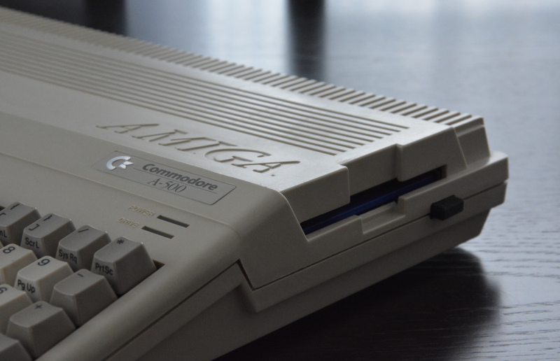

# Raspberry Pi 4 built into Amiga 500 case

This repo will explain how to put RPi into Amiga 500 case without any modifications. Moreover the goal is to explain how to build whatever mounts there may be needed to get all ports accessable.
The final result is no damage to original case is needed to make it look and work as a 100% original Amiga (thoug we know it will never be an Amiga, right? :smile:

---
* [Story behind this project](#story-behind-this-project)
* [Considerations and dependencies](#considerations-and-dependencies)
* [Final outcome](#final-outcome)
* [Costs summary](#costs-summary)
* [Useful resources available on web](#useful-resources-available-on-web)
* [Special thanks](#special-thanks)

---
### Story behind this project

Currently a placeholder...

### Considerations and dependencies

Currently a placeholder...

### Final outcome

This section needs some work...

### Costs summary

Not the cheapiest option... But again - info coming soon...

### Useful resources available on web

Links etc.

### Special thanks

Some people to thank to... :smile:
