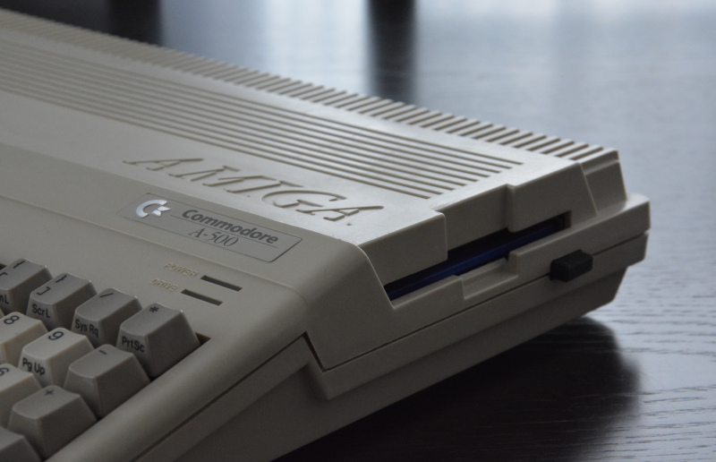
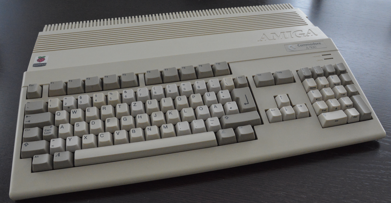
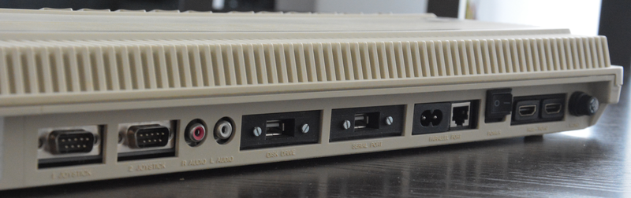
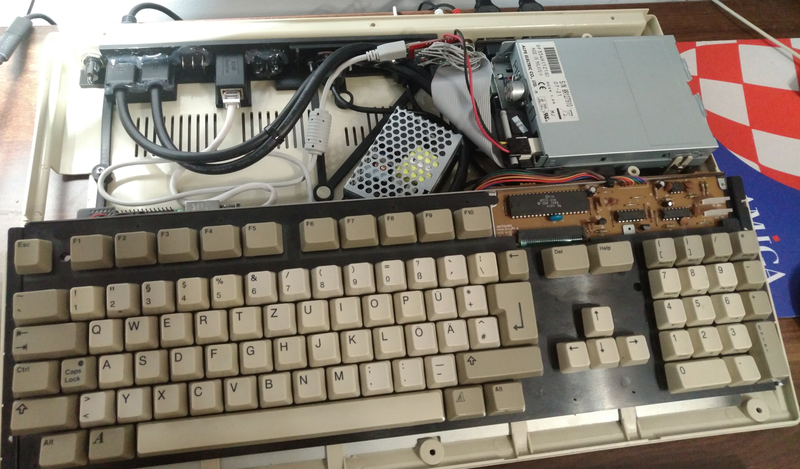

# Raspberry Pi 4 built into Amiga 500 case

This repo will explain how to put RPi into Amiga 500 case without any modifications. Moreover the goal is to explain how to build whatever mounts there may be needed to get all ports accessable.
The final result is no damage to original case is needed to make it look and work as a 100% original Amiga (thoug we know it will never be an Amiga, right? :smile:

---
* [Story behind this project](#story-behind-this-project)
* [Considerations and dependencies](#considerations-and-dependencies)
* [Resources section](#resources) | :arrow_right: [Take me to resources subpage now](resources/)
* [Final result](#final-result)
* [Costs summary](#costs-summary)
* [Useful resources available on web](#useful-resources-available-on-web)
* [Special thanks](#special-thanks)

---
### Story behind this project
This project was firstly introduced on Polish Amiga Portal's forum (ppa.pl) back in Jan 2020. The intention was to share this here on github as soon as everything is done. After 3 years since the initial post it's ready to be shared with others in a better fashon. By following hints and using the resources shared here you should be able to build a similar unit on your own.

My dream of actually owning Amiga 500 system takes me back to begining of '90s. Yep - I've never had one. The only opportunity to play any Amiga game was to visit my friends (thanks a lot Przemek, Bartek and Tomek :smile:). I was a sort of *8-bit guy* back then owning Atari 130XE system which quickly came to be obsolete when PCs came to power. Years passed but my love for retro only grew and some time ago I decided to visit my first Retro Party. Opportunity was to play my beloved **Sensible Soccer** tournament hosted at the party. A side effect of being there was an exposition to all this amazing hardware brought by retro-freaks. One of the units I've seen was special. At first glance it was just an Amiga 600 but it had a "strange" keyboard and no LEDs. After a short conversation with an owner I knew the secret - it wasn't an Amiga but a Raspberry Pi inside the A600 case. That day I've decided to build my own but better looking and with capability to recreate real feel and look.

I had to start from scratch as I've literally had nothing Amiga-related. No case, no keyboard no nothing. Everything had to be either just passed over to me for free or I had to pay for every single piece of hardware to make the dream come true. My first intention was to get a dead Amiga 500 unit and pull out MoBo to start with the case. To my surprise the prices were already crazy back then and today it's even worse. To give you an example from begining of 2023:
* Good looking Amiga 500 fully working costed approx. 150&euro; in Poland back in 2018.
* Same Amiga today is **at least double the price**.
* Local buy/sell portals like ebay are full of people selling retro hardware for insane prices even without any guarantee the unit will even work.

BTW I'm not complaining - it is what it is... :unamused:

The ultimate goal to get your own build is simple - to preserve hardware which is getting very rare even if we consider new releases of keyboard membranes, cases etc.
If you only have an access to keyboard and/or case = you're on the right path. For me a starting point was the case. Trapdoors I've had to buy separately - same for keyboard and everything. :smile:

### Considerations and dependencies
If you want to follow this guide please make sure you take into the account the following:
* This build is FULLY REVERSABLE - do not modify the case in any way. No drilling, cutting and other decomposition of case is needed.
* Once done your Amiga may serve as a daily driver for simple computer related tasks.
* You'll be running Linux as a core operating system. **THE YEAR OF LINUX WILL FINALLY ARRIVE - you have been warned!** :zany_face:
* You will spend money which is inevitable as you want to have a working keyboard, floppy drive and joysticks.
* To achieve best results you'll need to own a Raspberry Pi 4b (as at Mar 2023). The expectation is with release of RPi 5 this build will be adaptable easly.
* Originally the build was based on RPi 3b+ which later has been replaced. It doesn't make any sense to use RPi 3b+ as this SBC is to weak to fully utilize real floppy drive.
* You have a kickstart form a legal source to run it under Amiberry (Linux spin of WinUAE).
* Your Amiga 500 case is *Made in China*. This may or may not be a consideration but there may be some difference in dimensions between "mount points" inside the case.
> That's why my recomendation would be to have a test 3d printout or a paper printout from the CAD project file (1:1 scale) to check if it fits.
> CAD files are not provided everywhere so please check the resources to make sure it's OK.

:red_circle: This build is **fully dependent** on the following:
* Raspberry Pi 4b with active cooling (heatsink+fan is mandatory).
* Amiga 500 USB Keyboard Controller (internal connection with audio passthrough) by [Tynemouth Software](http://blog.tynemouthsoftware.co.uk).
> This will provide you with working DB9 joystick ports, audio and keyboard.
* Arduino Amiga Floppy Disk Reader/Writer aka DrawBridge by [Robert Smith](https://amiga.robsmithdev.co.uk).
> This will give you a fully working floppy drive.
* External PU to feed entire hardware with right amount of power.
> Please consider you'll be running a lot of things inside which will cause undervoltage warnings if powered just via RPi's USB ports.
* SSD drive in place of memory card to optimize performance of RPi.
* Kilometers of extenders to get ports accessable from the back of the case... :smile:
> Please make sure you're using a good quality extenders. Going after cheap ones may cause you trouble.
* Soldering is necessary. It's better to have someone do this for you if you're not OK doing this on your own.
* 3D printing.

:yellow_circle: You may also consider the following (optional) deps:
* CAD software to tweak the *stl* files in case there's a need.
* Raspberry Pi overclocking.
* Last but not least - a lot of free time once your build works to spend it with your Amiga.

### Resources
The following resources listed below are made available. In most cases it's done by me from scratch. Whenever the file is not built by me - I'll try to flag the source and owner/creator if I can recall the exact source.
Please feel free to use, modify these and experiment. Should you store these files and/or share on your own you're free to do that in compliance with [GNU General Public License v3.0](https://github.com/EMPI-PL/RPi_in_Amiga500_case/blob/main/LICENSE).
* [Pictures](https://github.com/EMPI-PL/RPi_in_Amiga500_case/tree/main/pic)
> Photo documentation of building process in time.
* [STL files](https://github.com/EMPI-PL/RPi_in_Amiga500_case/tree/main/resources/stl)
> 3d printer files to get mounts and other things ready and prepared for build.
* [CAD files](https://github.com/EMPI-PL/RPi_in_Amiga500_case/tree/main/resources/cad) provided in *FCstd* format
* RPi configs and helpers incl. overclock setup (coming soon)

### Final result

### Costs summary
Total cost is provided in &euro; with an exchange rate from Polish Zloty as at Mar 31st 2023 which is 1EUR = 4.67PLN.
Below prices exclude shipping and other costs.

| Item | Price in &euro; | Comment |
|---|---:|---|
| A500 case | 20&euro; | Trapdoors not included |
| A500 case trapdoors | 8&euro;| |
| A500 keyboard | 30&euro; | F8 key non-functional :pensive: |
| RPi 4b | 87&euro; | This was an expense carried to repleace RPi 3 as the project evolved |
| A500 Keyboard Controller | 68&euro; | Critical component available on [Tynemouth's Software](http://blog.tynemouthsoftware.co.uk) store |
| Port extenders | 15&euro; | Including 2x USB 2.0; HDMI etc. |
| 3D printouts | 20&euro; | |
| Screws and floppy drive with self build DrawBridge solution | 18&euro; | You should really consider building your own Drawbridge drive following [this guide by Robert Smith](https://amiga.robsmithdev.co.uk) |
| Power supply + wires, soldering, switches and fuses | 27&euro; | I'm using Mean Well RS-25-5 power supply - 5V/5A/25W |
| SSD drive + SATA->USB converter | 20&euro; | |
| **TOTAL** | **313&euro;** | |

### Useful resources available on web
You may want to visit the following sites for some inspiration and potentially additional discussions (flag indicates sites' languages):
* :poland: [Malinowa Amiga](https://malinowaamiga.wordpress.com) - one of the early inspirations + personal talks with site owner on RETROnizacja Retro Party.
* :poland: [RETROnizacja](https://retronizacja.pl) - one of the best Retro Party in Poland.
* :poland: [Amiparty](https://chal.pl) - best Amiga-only Party in Poland.
* :poland: [Polski Portal Amigowy](https://www.ppa.pl) - ppa.pl is a Polish Amiga Community portal.
* :uk: [Amiga Love forum thread on the simillar project](https://www.amigalove.com/viewtopic.php?f=6&t=552) - one of the early inspirations + you can reach out to the community there.
* :uk: [DrawBridge](https://amiga.robsmithdev.co.uk) - homepage of the amazing Floppy Drive project.
* :uk: [Tynemouth Software Store](https://www.sellmyretro.com/store/tynemouth-software) - you can get a converter for keyboard, joys and audio there.
* :uk: [Botland](https://botland.store) - Polish store to get you Raspberry Pi gear.
* :uk: :ireland: [Sordan](https://sordan.ie) - Great and cheap electronics shop may help you in getting your gear as well.

### Special thanks
There are many people I'd like to thank for their help and support. Some of them may not be aware of their help... :zany_face:
* My wonderful wife... :smiling_face_with_three_hearts:
* My *szwagier* + my other *szwagier*... (Polish for *brother-in-law*)
* Polish Amiga Community around Polski Portal Amigowy - ppa.pl and RETROnizacja Party.
* MariuszK - your help was critical! Thanks man!
* Tomus - some good overclocking tips for RPi.
* Dimitris Panokostas (aka ***midwan***) for creating and maintaining Amiberry software.
* Chris Edwards for creating and maintaining PiMiga.
* Robert Smith for creating DrawBridge - key element to get floopy up and running.
* Probably couple of others I can't recall at the moment. Big thanks to you as well... :hugs:
