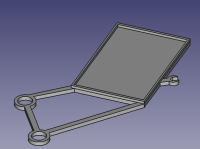

# Resources
This site will take you through all resources available on this repo. If you haven't read the main page I would strongly recomend to do so before getting these files 3d printed etc.
Reason is your case may have a different dimensions which potentially may force you to tweak the CAD files to adapt them to your usecase.

---
| Element view | Section | STL file | FreeCAD file | Additional information |
| --- | --- | --- |:---:| --- |
|  | Power Supply | n/a |  | Main mount for **Mean Well RS-25-5 power supply - 5V/5A/25W** |
| | | | | |
| | | | | |
| | | | | |
