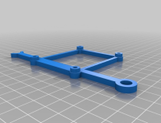

# Resources
This site will take you through all resources available in this repo. If you haven't read the main page I would strongly recomend to do so before getting these files 3d printed etc.
Reason is your case may have a different dimensions which potentially may force you to tweak the CAD files to adapt them to your usecase.

**NOTE:** Files without *FreeCAD* version are not built by me personally. These files will not be stored in this repo because the license upon which these files are published must not be simply *overwritten*. An author and license info will be provided in **Additional information** column while stl links will take you to the original source of file.

---
| Element view | Section | STL file | FreeCAD file | Additional information |
| --- | --- |:---:|:---:| --- |
|  | Power Supply |  |  | Main mount for **Mean Well RS-25-5 power supply - 5V/5A/25W**. |
|  | Power Supply |  |  | An element of PS mount to prevent movement inside the case. |
|  | Power Supply |  |  | A small element that should be glued on top of connection slot to provide stabilization. |
|  | A500 case rear |  |  | Provides a mount for ethernet, power fuse, power switch, 2x HDMI female connectors and power connector. |
|  | A500 case rear |  | n/a | :triangular_flag_on_post: **External resource** Provides a mount for 2x USB ports. You need to cut off "audio" part to allow audio composite ports usage.  This part is built by: Matthew Martin (aka ***mattsoft***) and is licensed under the [Creative Commons - Attribution](https://creativecommons.org/licenses/by/4.0/) license. |
|  | Raspberry Pi |  | n/a | :triangular_flag_on_post: **External resource** This element will allow to mount RPi inside the case with where it's SD card slot is easly accessable via side trapdoor  This part is built by: Matthew Martin (aka ***mattsoft***) and is licensed under the [Creative Commons - Attribution](https://creativecommons.org/licenses/by/4.0/) license. |
|  | Keyboard converter |  | n/a | :triangular_flag_on_post: **External resource** A mount for Amiga 500 USB Keyboard Controller.  This part is built by: Matthew Martin (aka ***mattsoft***) and is licensed under the [Creative Commons - Attribution](https://creativecommons.org/licenses/by/4.0/) license. |
|  | Keyboard converter |  | n/a | :triangular_flag_on_post: **External resource** Adapters/covers which may be usable to keep mounts in place.  This part is built by: Matthew Martin (aka ***mattsoft***) and is licensed under the [Creative Commons - Attribution](https://creativecommons.org/licenses/by/4.0/) license. |
|  | Floppy drive |  |  | Left mount for floppy drive. May need tweaking to adapt to other manufacturers. **Suitable for ALPS floppy drive**. |
|  | Floppy drive |  |  | Right mount for floppy drive. May need tweaking to adapt to other manufacturers. **Suitable for ALPS floppy drive**. |
|  | Floppy drive |  |  | Element that connects both sides of floppy mount. **Suitable for ALPS floppy drive**. |
|  | Floppy drive |  |  | Support for floppy mount. Build 1 unit of it.  **Suitable for ALPS floppy drive**. |
|  | Floppy drive |  |  | Support for floppy mount. Build 2 units of it.  **Suitable for ALPS floppy drive**. |
| | | | | |
| | | | | work in progress |

